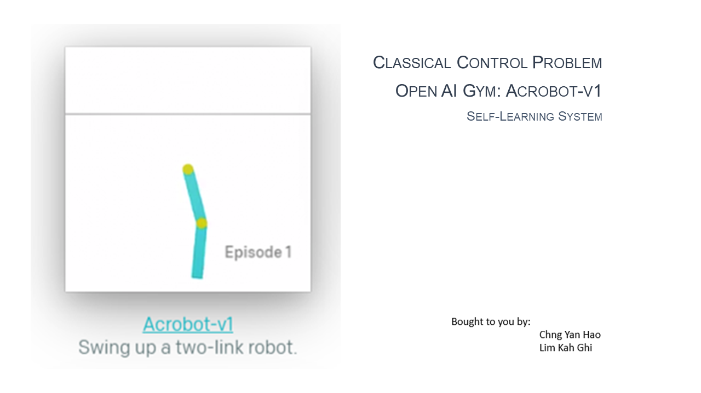
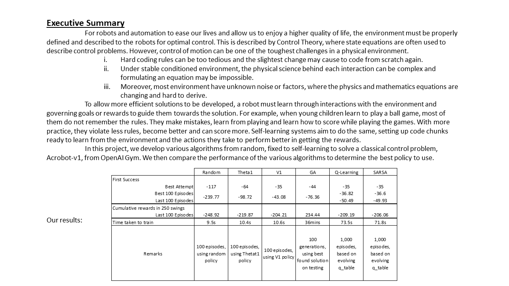

## SECTION 1 : PROJECT TITLE
## Acrobot-v1: Genetic Algorithm / Q-Learning / SARSA

---

## SECTION 2 : EXECUTIVE SUMMARY

---

## SECTION 3 : CREDITS / PROJECT CONTRIBUTION

| Official Full Name  | Student ID (MTech Applicable)  | Work Items (Who Did What) | Email (Optional) |
| :------------ |:---------------:| :-----| :-----|
| Lim Kah Ghi | A0100172A | from 0% to 100% | E0508022@u.nus.edu |
| Chng Yan Hao | A0024023A | from 0% to 100% | E0529228@u.nus.edu |

---

## SECTION 4 : ANIMATION

### Last episode of SARSA agent. 
### Trained ~ 4hrs, 10,000 episodes, 5,000 swings per episode

---

## SECTION 5 : USER GUIDE

`Refer to appendix`[QuickUserGuide](https://github.com/RyanChngYanHao/ISA-PM-SLS-2021-01-09-IS02PT-GRP-Acrobot-v1/blob/master/ProjectReport/QuickUserGuide.pdf) `in Github Folder: ProjectReport`

-	Download Acrobot.zip
-	Python 3.7.6
-	Packages: gym, time, numpy, math, matplotlib, imageio, PIL

### Recommended:
-	A GUI to view the python codes, E.g. Spyder

---
## SECTION 6 : PROJECT REPORT / PAPER

`Refer to`[ProjectReport](https://github.com/RyanChngYanHao/ISA-PM-SLS-2021-01-09-IS02PT-GRP-Acrobot-v1/blob/master/ProjectReport/ProjectReport.pdf) `in Github Folder: ProjectReport`

**Recommended Sections for Project Report / Paper:**
- Executive Summary
- Design of Acrobot-v1
- Results

---
## SECTION 7 : MISCELLANEOUS

`Refer to Github Folder: Miscellaneous`
- Acrobot.png
- ExecutiveSummary.png

---

**Special thanks to [NUS-ISS](https://www.iss.nus.edu.sg "Institute of Systems Science, National University of Singapore") lecturers in [Intelligent Software Agents (ISA)](https://www.iss.nus.edu.sg/executive-education/course/detail/practice-module-for-intelligent-software-agents "Intellgient Software Agents"), making this possible.**
